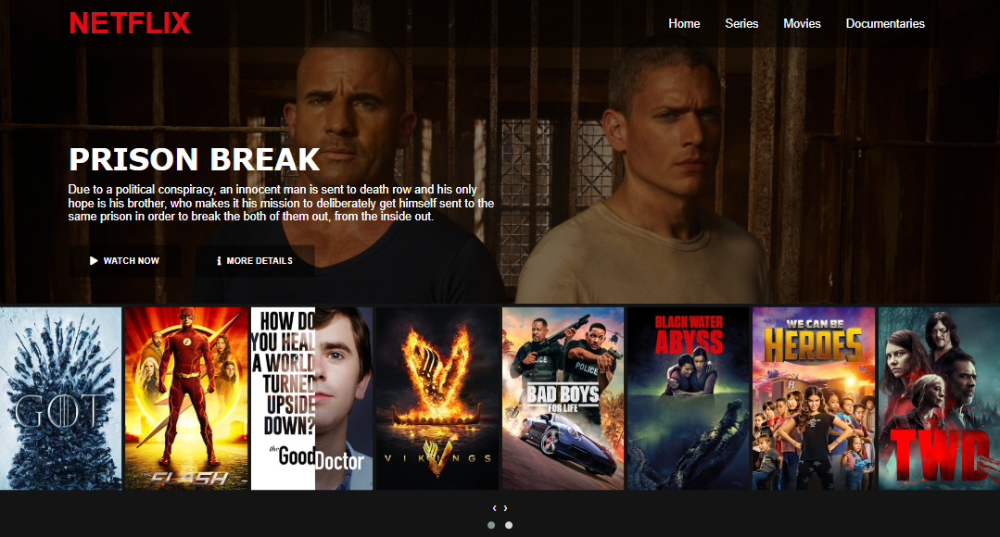

# NETFLIX CLONE
## 📚 Initial Project of the Avanade Angular Developer Bootcamp

## 📱💻🖥 I implemented several media queries to make it very responsive.

## 🚀 Technologies used in this project

Made with ♥ by Maiqui Tomé 😀
  

*Reach out to me* 👇

